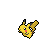

# PokeGAN - Pokemon Sprite Creation
              
 
 #

This repo is used to scrape Pokemon sprite images from [https://pokemondb.net/sprites](https://pokemondb.net/sprites) and then use them to train a Generative Adversarial Network (GAN) to create new sprites.

**In progress**