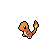
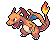
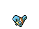
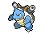
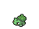
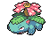

# PokeGAN - Pokemon Sprite Creation via DCGAN

           

**This repo is used to scrape Pokemon sprite images from [https://pokemondb.net/Pokemon](https://pokemondb.net/Pokemon) and then use them to train a Generative Adversarial Network (GAN) to create new Pokemon.**

Pokemon can be scraped using *scrape.py* and the DCGAN can then be trained using *train.py*. Generator weights are saved under **weights/** and images generated at each epoch are saved under **generated/**.
