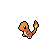
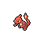
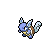
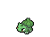
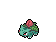

# PokeGAN - Pokemon Sprite Creation via DCGAN
            

**This repo is used to scrape Pokemon sprite images from [https://pokemondb.net/sprites](https://pokemondb.net/sprites) and then use them to train a Generative Adversarial Network (GAN) to create new sprites.**

Sprites can be scraped using *scrape.py* and the DCGAN can then be trained using *train.py*. Generator weights are saved under **weights/** and images generated at each epoch are saved under **generated/**.